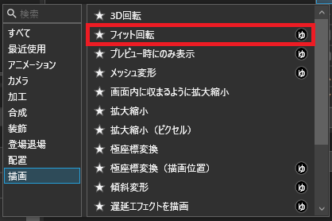

# FitRotateEffect
## 概要
映像エフェクト**フィット回転**を追加します。  
画像を回転させ、それに合わせて拡大を行います。  
画像を回転させても余白が生まれなくなります。  

## 導入方法
### [最新バージョンをダウンロード](https://github.com/tetra-te/FitRotateEffect/releases/latest)
ダウンロードしたファイルをダブルクリックして、表示される画面にしたがってインストールしてください。
> [!NOTE]
> ファイルをダブルクリックしてもインストールできない場合は、YMM4を起動して`ヘルプ(H)`>`YMM4用拡張子の関連付け`>`登録する`から拡張子の関連付けを行ってください。
> 再度ファイルをダブルクリックすることでインストール画面が表示されます。

## 使用方法
映像エフェクトの**描画**カテゴリから**フィット回転**を追加してください。  

### 回転角
画像を回転させる角度
### サイズを固定
有効にすると領域からはみ出した部分を切り抜きます。

## アンインストール方法
1. YMM4を起動して`ヘルプ(H)`>`その他`>`プラグインフォルダを開く`をクリックする。
2. YMM4を終了する。
3. `FitRotateEffect`という名前のフォルダを削除する。

## ライセンス
[CC0 1.0 Universal](/LICENSE)
